# InEight AI Chatbot - Architectural Diagrams

This document provides visual representations of the system architecture at various levels of detail.

---

## 1. High-Level System Architecture

---

## 2. Component Architecture

### 2.1 Solution Structure

### 2.2 Core Layer Components

### 2.3 Infrastructure Layer Components

---

## 3. Data Flow Diagrams

### 3.1 Document Synchronization Flow

### 3.2 Chat Query Processing Flow

---

## 4. Deployment Architecture

### 4.1 Development Environment

### 4.2 Production Architecture (Future)

```mermaid
graph TB
    subgraph "Azure Cloud"
        subgraph "App Services"
            API["Chatbot API<br/>(Azure App Service)"]
            DMS["DMS Web<br/>(Azure App Service)"]
        end
        
        subgraph "AI Services"
            OpenAI["Azure OpenAI<br/>(GPT-4o)"]
            Search["Azure AI Search<br/>(Vector Search)"]
        end
        
        subgraph "Data Services"
            SQL["Azure SQL<br/>Database"]
            KeyVault["Azure Key Vault<br/>(Secrets)"]
        end
        
        subgraph "Monitoring"
            AppInsights["Application<br/>Insights"]
            LogAnalytics["Log Analytics"]
        end
    end
    
    Users["👥 Users"] -->|HTTPS| DMS
    DMS -->|Embed Widget| DMS
    DMS -->|API Calls| API
    API -->|Read Metadata| SQL
    API -->|Vector Search| Search
    API -->|AI Requests| OpenAI
    API -->|Get Secrets| KeyVault
    API -->|Telemetry| AppInsights
    DMS -->|Telemetry| AppInsights
    AppInsights -->|Logs| LogAnalytics
    
    style API fill:#f3e5f5
    style DMS fill:#fff4e6
    style OpenAI fill:#fce4ec
    style Search fill:#e1f5ff
    style SQL fill:#e0f2f1
```

---

## 5. Security Architecture

### 5.1 Authentication Flow

### 5.2 Access Control Model

---

## 6. Database Schema Diagrams

### 6.1 PostgreSQL Vector Database

### 6.2 DMS Database (Relevant Tables)

---

## 7. Component Interaction Diagrams

### 7.1 RAG Pipeline Components

### 7.2 Provider Abstraction Pattern

---

## 8. Network Architecture

### 8.1 Development Network Topology

### 8.2 CORS Configuration

---

## 9. State Diagrams

### 9.1 Chat Widget State Machine

### 9.2 Document Sync State Machine

---

## 10. Technology Stack Diagram

---

## Summary

This architectural documentation provides:

1. **High-Level Architecture** - Overall system structure and component relationships
2. **Component Architecture** - Detailed breakdown of solution structure and classes
3. **Data Flow Diagrams** - Visual representation of document sync and chat query flows
4. **Deployment Architecture** - Development and production environment layouts
5. **Security Architecture** - Authentication and access control mechanisms
6. **Database Schemas** - Entity relationships and table structures
7. **Component Interactions** - RAG pipeline and provider abstraction patterns
8. **Network Architecture** - Port configurations and CORS policies
9. **State Diagrams** - Widget and sync service state machines
10. **Technology Stack** - Complete technology overview

These diagrams serve as comprehensive reference for understanding, maintaining, and extending the InEight AI Chatbot system.
