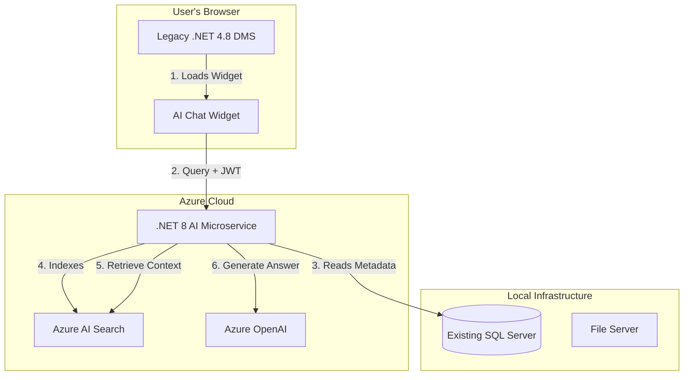

# InEight Document AI Chatbot MVP - Project Design

## 1. Executive Summary
This MVP consists of **two integrated components**:
1. **Document Management System (DMS)**: A standalone application for managing projects, users, and documents with comprehensive metadata tracking.
2. **AI Chatbot**: An intelligent assistant that answers natural language questions about document metadata, linked items (RFIs, Transmittals), and document actions.

The system allows Admins and Project Managers to manage projects and documents, while users can query the chatbot to retrieve information based on their access permissions.

### Key Features
- **Role-Based Access Control (RBAC)**: Admin, Project Managers, Project Users
- **Comprehensive Document Metadata**: 26+ fields including transmittals, revisions, approvals
- **Linked Items Support**: Query documents based on RFIs, Mail responses, Transmittals, Forms, Tasks
- **Action-Based Queries**: Track and query document actions (updates, reviews, replacements)
- **AI Chatbot**: Natural language search with metadata RAG
- **Smart Responses**: Returns direct document links or filtered document register views
- **Failed Query Handling**: Knowledge Base integration for unsupported queries
- **Hybrid Architecture**: Legacy .NET 4.8 App + New .NET 8 AI Service

## 2. High-Level Architecture

### Tech Stack
- **Frontend**: React (Vite) + Tailwind CSS + Shadcn/UI
- **Backend**: .NET 8 Web API (C#)
- **Database**: Azure SQL Database (Metadata, User Data, Linked Items)
- **Storage**: Local File Server (Existing). *No files uploaded to Cloud.*
- **Hosting**: Azure App Service / Azure Static Web Apps
- **Source Control**: Azure DevOps (Git)
- **AI & Search**:
    - **Azure OpenAI**: GPT-4o/GPT-3.5-Turbo for natural language understanding
    - **Azure AI Search**: Vector database for metadata + linked items retrieval
    - *(Alternative)*: PostgreSQL with pgvector for cost-saving

### System Architecture Diagram


## 3. Low-Level Design

### 3.1 Database Schema (Enhanced)

**Users**
- `Id`, `Email`, `PasswordHash`, `Role`, `Name`

**Projects**
- `Id`, `Name`, `Description`, `ManagerId` (FK → Users)

**ProjectUsers** (Many-to-Many)
- `ProjectId`, `UserId`

**Documents** (Expanded to 26+ fields)
- `Id`, `ProjectId`, `Name`, `Description`
- `Type`, `Category`, `Tags`
- `UploadedBy`, `UploadedAt`, `UploadLocation`
- `UpdatedBy`, `UpdatedAt`
- `Status`, `TransmittalNumber`
- `Version`, `RevisionNumber`
- `ManagerId`, `AssignedUserId`
- `ApprovalStatus`, `ApprovedBy`, `ApprovedAt`, `ApprovalComment`

**DocumentLinks** (New)
- `DocumentId`, `LinkedDocumentId`, `LinkType` (Reference, Supersedes, Related)

**DocumentRevisions** (New)
- `Id`, `DocumentId`, `RevisionNumber`, `RevisionDate`, `RevisionComment`, `RevisionStatus`, `RevisedBy`

**LinkedItems** (New - RFI, Transmittals, Forms, Tasks)
- `Id`, `DocumentId`, `ItemType` (RFI, Transmittal, Mail, Form, Task)
- `ItemStatus` (Open, Closed, Pending)
- `ItemNumber`, `CreatedBy`, `CreatedAt`, `Metadata` (JSON)

**DocumentActions** (New)
- `Id`, `DocumentId`, `ActionType` (Updated, Reviewed, Replaced, Removed, Bluebeam Review)
- `ActionBy`, `ActionAt`, `ToolUsed`, `Details` (JSON)

**ChatSessions**
- `Id`, `UserId`, `Title`, `CreatedAt`

**ChatMessages**
- `Id`, `SessionId`, `Role`, `Content`, `Timestamp`, `ResponseMetadata` (JSON)

**FailedQueries** (New)
- `Id`, `UserId`, `Query`, `Reason`, `Timestamp`, `SuggestedKBLink`

### 3.2 API Endpoints (.NET 8 Microservice)

#### Chat Interface
- `POST /api/chat/message`: Process natural language query
    - **Headers**: `Authorization: Bearer <JWT>`
    - **Body**: 
    ```json
    {
      "query": "Show me documents uploaded today",
      "projectId": 123,
      "sessionId": "abc-123"
    }
    ```
    - **Response**:
    ```json
    {
      "answer": "Found 3 documents uploaded today.",
      "links": [
        {
          "type": "document",
          "id": 456,
          "title": "Safety Protocol Rev 2",
          "url": "/documents/456"
        },
        {
          "type": "filtered_view",
          "description": "All documents uploaded today",
          "url": "/documents?uploadedDate=2024-01-18&project=123"
        }
      ],
      "confidence": 0.92,
      "fallbackKBLink": null
    }
    ```

- `POST /api/chat/generate-link`: Generate deep link to filtered document register
    - **Body**: `{ "filters": { "status": "IFC", "uploadedToday": true } }`

#### Metadata Indexing
- `POST /api/admin/sync-metadata`: Trigger metadata sync
- `POST /api/admin/sync-linked-items`: Trigger linked items sync
- `POST /api/admin/sync-actions`: Trigger document actions sync

#### Failed Query Management
- `GET /api/admin/failed-queries`: Retrieve failed queries for analysis
- `POST /api/admin/failed-queries/{id}/resolve`: Mark as resolved with KB link

### 3.3 Integration & Security Strategies

**Authentication Handoff**
1. Legacy App generates JWT (Shared Secret)
2. JWT contains: `UserId`, `Roles`, `ProjectIds`, `AccessibleDocuments`
3. AI Service validates JWT and respects user security context

**Data Security**
- **No File Content** transmitted
- **Metadata Only** indexing
- **User Security Respected**: Chatbot only returns data accessible to logged-in user
- **Filtered Results**: Documents not in user's projects return "Document exists but not accessible" with project name

**Connectivity**
- VPN Gateway / Azure Hybrid Connection for on-prem SQL access
- Alternative: Metadata Export API on Legacy Server

**Failed Query Handling**
- Low confidence queries (< 0.7) trigger KB lookup
- Log failed queries for InEight product team review
- Return specific KB topic links when possible

### 3.4 Chatbot Capabilities

**Search/Filter Capabilities**

1. **Document Metadata Queries**
   - Standard fields: "Show me IFC drawings", "Documents uploaded today"
   - Custom fields: User-defined metadata
   
2. **Linked Items Queries**
   - "Show documents with open RFIs"
   - "Documents included in submittals"
   - "Show documents with pending mail responses"

3. **Action-Based Queries**
   - "Which documents were updated using Bluebeam?"
   - "Documents reviewed using change document details"
   - "Show documents updated via replace/remove view files"

4. **User-Related Queries**
   - "Who uploaded document X?"
   - "Show documents reviewed by User Y"
   - "Which users have access to this document?"

**Response Types**
- **Direct Document Link**: Single document match
- **Filtered Document Register**: Multiple matches with filter URL
- **Knowledge Base Link**: Unsupported queries
- **Access Denied**: User lacks permission with project context

## 4. UI/UX Strategy

**Chat Widget**
- Standalone React component (`chat-widget.js`)
- Floating Action Button (bottom-right)
- Modern chat interface with:
  - Natural language input
  - Rich responses with clickable links
  - Document preview cards
  - "Open in Document Register" button for filtered views
  - KB link suggestions for failed queries

**Styling**
- Scoped CSS (Tailwind prefix)
- No conflicts with Legacy styles
- Responsive design

## 5. Implementation Steps

### Phase 1: Enhanced DMS Setup
1. Create .NET 8 Solution with expanded schema
2. Implement User/Project/Document CRUD with 26 metadata fields
3. Add Linked Items management (RFI, Transmittals)
4. Add Document Actions tracking

### Phase 2: Metadata Indexing
1. Implement MetadataSyncService (26 fields)
2. Implement LinkedItemsSyncService
3. Implement DocumentActionsSyncService
4. Index to Azure AI Search with proper security filters

### Phase 3: Enhanced AI Service
1. Implement RAGOrchestrator with:
   - Natural language query parsing
   - Multi-source retrieval (metadata + linked items + actions)
   - User security filtering
   - Confidence scoring
2. Implement ResponseGenerator:
   - Structure responses with links
   - Generate document register filter URLs
   - KB integration logic

### Phase 4: Chat Widget
1. Build React widget with rich response rendering
2. Add link handling (document vs. filtered view)
3. Add KB link display for failed queries

### Phase 5: Integration & Testing
1. JWT integration with Legacy App
2. Embed widget in Legacy UI
3. Test user security boundaries
4. Test failed query KB linking
