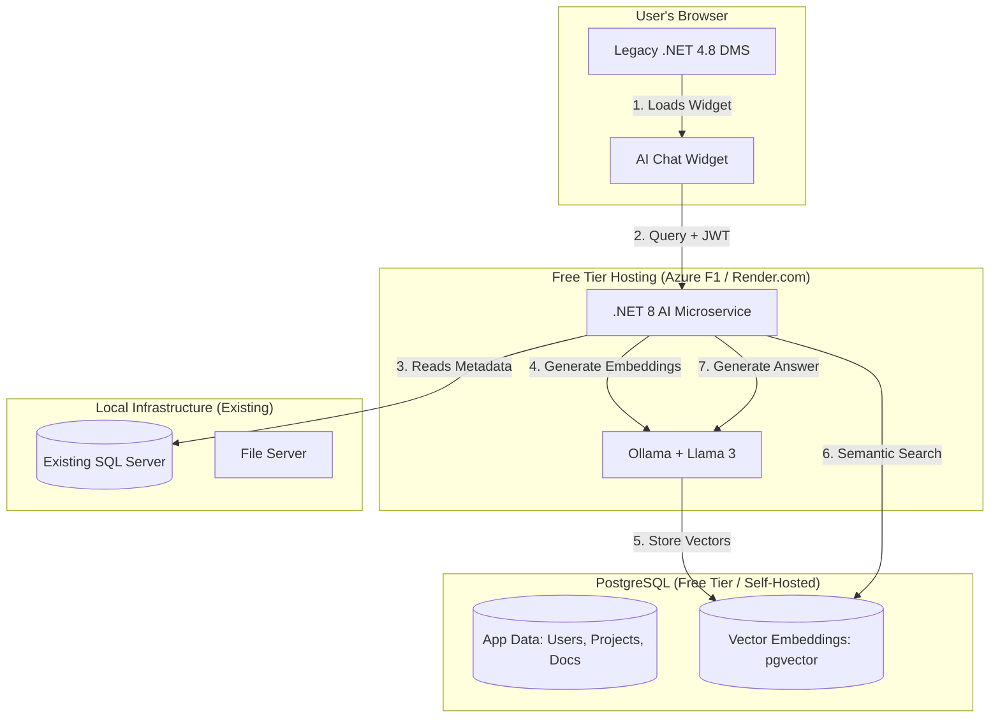

# InEight Document AI Chatbot MVP - Alternative Design (Free Tier)

## 1. Executive Summary
This is a **cost-optimized alternative** to the main MVP design, utilizing **free and open-source tools** to achieve the same functionality with **near-zero operational costs**. Ideal for development, testing, or organizations with strict budget constraints.

### Key Differences from Main Design
- **Vector Search**: PostgreSQL + pgvector (free, self-hosted) instead of Azure AI Search
- **AI Model**: Local Ollama + Llama 3 or Azure OpenAI Free Tier (gpt-3.5-turbo with credits)
- **Hosting**: Azure App Service Free Tier (F1) or self-hosted
- **Database**: Azure SQL Database Free Tier or PostgreSQL (same instance as vector store)
- **Estimated Monthly Cost**: **$0 - $5** (vs. $100-150 in main design)

### Components
1. **Document Management System (DMS)**: Same as main design
2. **AI Chatbot**: Uses pgvector for semantic search + local LLM or free-tier OpenAI

---

## 2. High-Level Architecture

### Tech Stack (Free Tier)
- **Frontend**: React (Vite) + Tailwind CSS (Free)
- **Backend**: .NET 8 Web API (Free, Open Source)
- **Database**: 
  - **Option A**: PostgreSQL 16+ with pgvector extension (Free, Self-hosted or Render.com free tier)
  - **Option B**: Azure SQL Database Free Tier (32GB) + PostgreSQL for vectors only
- **Vector Store**: PostgreSQL with pgvector extension (Free)
- **AI Model**:
  - **Option A**: Ollama + Llama 3 / Mistral (Free, runs locally or on server)
  - **Option B**: Azure OpenAI Free Trial ($200 credit) or gpt-3.5-turbo (lowest cost)
  - **Option C**: OpenAI API Free Tier (limited requests)
- **Hosting**:
  - **Option A**: Azure App Service F1 Free Tier (1GB RAM, 60 min/day compute)
  - **Option B**: Self-hosted on existing server (IIS + Kestrel)
  - **Option C**: Render.com Free Tier or Railway.app

### System Architecture Diagram


---

## 3. Component Details

### 3.1 PostgreSQL with pgvector (Replaces Azure AI Search)

**What is pgvector?**
- PostgreSQL extension for vector similarity search
- Supports exact and approximate nearest neighbor search
- Efficiently stores and queries high-dimensional vectors (embeddings)
- **Cost**: $0 (open source)

**Setup**:
```sql
-- Install pgvector extension
CREATE EXTENSION vector;

-- Create embeddings table
CREATE TABLE document_embeddings (
    id SERIAL PRIMARY KEY,
    document_id INT NOT NULL,
    chunk_text TEXT NOT NULL,
    embedding vector(384), -- or vector(768) depending on model
    metadata JSONB,
    user_access_list INT[],
    created_at TIMESTAMP DEFAULT NOW()
);

-- Create index for fast similarity search
CREATE INDEX ON document_embeddings 
USING ivfflat (embedding vector_cosine_ops)
WITH (lists = 100);

-- Similar tables for linked items and actions
CREATE TABLE linked_item_embeddings (
    id SERIAL PRIMARY KEY,
    item_id INT NOT NULL,
    item_type VARCHAR(50),
    embedding vector(384),
    metadata JSONB
);

CREATE TABLE action_embeddings (
    id SERIAL PRIMARY KEY,
    action_id INT NOT NULL,
    embedding vector(384),
    metadata JSONB
);
```

**Hosting Options**:
1. **Self-Hosted** (Existing server): $0 cost
2. **Render.com Free Tier**: Free PostgreSQL (1GB storage, sleeps after 15min inactivity)
3. **Railway.app**: $5/month (500hrs free)
4. **Supabase Free Tier**: Free PostgreSQL with pgvector pre-installed (500MB storage)

### 3.2 Local LLM with Ollama (Replaces Azure OpenAI)

**What is Ollama?**
- Free tool to run large language models locally
- Supports Llama 3, Mistral, Phi-3, CodeLlama
- API-compatible with OpenAI format
- **Cost**: $0 (requires local GPU/CPU)

**Installation**:
```bash
# Install Ollama (Windows/Linux/Mac)
curl -fsSL https://ollama.com/install.sh | sh

# Pull a model (Llama 3 8B - 4.7GB download)
ollama pull llama3

# Or use smaller model for development
ollama pull phi3:mini  # 2.3GB, faster inference

# Start Ollama server (runs on localhost:11434)
ollama serve
```

**Usage in .NET**:
```csharp
// NuGet: OllamaSharp
var ollama = new OllamaApiClient("http://localhost:11434");

var response = await ollama.GenerateCompletion(new GenerateCompletionRequest
{
    Model = "llama3",
    Prompt = "Answer based on these documents: ...",
    Stream = false
});
```

**Performance**:
- **CPU-only**: 5-10 tokens/sec (acceptable for chatbot)
- **With GPU (NVIDIA)**: 30-50 tokens/sec
- **Embedding generation**: ~100 documents/sec

**Alternative Free AI Options**:
1. **Hugging Face Inference API**: Free tier (1000 requests/month)
2. **Azure OpenAI Free Trial**: $200 credit (expires after 30 days)
3. **OpenAI gpt-3.5-turbo**: $0.0015/1K tokens (cheapest option, ~$5-10/month for MVP)

### 3.3 Embedding Generation (Free)

**Option A: Local Embedding Models**
```bash
# Use sentence-transformers (Python or .NET)
pip install sentence-transformers

# Or use Ollama for embeddings
ollama pull nomic-embed-text  # 274MB, generates 768-dim vectors
```

**.NET Integration**:
```csharp
// NuGet: Microsoft.ML.OnnxRuntime + all-MiniLM model
var embedder = new SentenceTransformer("all-MiniLM-L6-v2");
float[] embedding = embedder.Encode("Document text...");

// Insert into PostgreSQL
await using var cmd = new NpgsqlCommand(
    "INSERT INTO document_embeddings (document_id, chunk_text, embedding) VALUES ($1, $2, $3)",
    connection);
cmd.Parameters.AddWithValue(documentId);
cmd.Parameters.AddWithValue(chunkText);
cmd.Parameters.AddWithValue(new NpgsqlTypes.NpgsqlVector(embedding));
await cmd.ExecuteNonQueryAsync();
```

**Option B: Hugging Face Free API**
- Model: `sentence-transformers/all-MiniLM-L6-v2`
- Cost: Free (1000 API calls/month)
- Latency: ~200ms/request

### 3.4 Free Database Options

**Option A: Azure SQL Database Free Tier**
- **Storage**: 32GB
- **Compute**: S0 tier (10 DTUs)
- **Cost**: $0/month (12 months free, then ~$15/month)
- Use for app data (Users, Projects, Documents metadata)
- Use PostgreSQL only for vector storage

**Option B: PostgreSQL Only (Unified)**
- Single PostgreSQL instance for both app data AND vectors
- **Hosting**: Supabase Free (500MB) or self-hosted (unlimited)
- **Cost**: $0 (self-hosted) or $0 (Supabase free tier)

**Recommendation**: Use PostgreSQL for everything (simpler, truly free)

### 3.5 Free Hosting Options

**Option A: Azure App Service F1 Free Tier**
- **Specs**: 1GB RAM, 1GB storage, 60 CPU minutes/day
- **Limitation**: App sleeps after 20min inactivity (cold start on next request)
- **Cost**: $0/month
- **Good for**: Development and low-traffic testing

**Option B: Self-Hosted (Existing Infrastructure)**
- Deploy .NET 8 API on existing Windows Server (IIS) or Linux server
- **Cost**: $0 (uses existing resources)
- **Good for**: Production if server capacity available

**Option C: Render.com / Railway.app**
- **Render Free Tier**: 750hrs/month free (sleeps after 15min)
- **Railway**: $5/month (500hrs free compute)
- **Good for**: Always-on development environment

---

## 4. Implementation Differences

### 4.1 MetadataSyncService Changes

**Main Design** (Azure AI Search):
```csharp
var searchClient = new SearchClient(endpoint, indexName, credential);
await searchClient.UploadDocumentsAsync(documents);
```

**Free Alternative** (pgvector):
```csharp
// Generate embedding locally
var embedding = await embedder.EncodeAsync(documentText);

// Insert into PostgreSQL
await using var cmd = new NpgsqlCommand(@"
    INSERT INTO document_embeddings 
    (document_id, chunk_text, embedding, metadata, user_access_list)
    VALUES ($1, $2, $3, $4, $5)",
    connection);
cmd.Parameters.AddWithValue(doc.Id);
cmd.Parameters.AddWithValue(doc.Text);
cmd.Parameters.AddWithValue(new NpgsqlVector(embedding));
cmd.Parameters.AddWithValue(JsonSerializer.Serialize(doc.Metadata));
cmd.Parameters.AddWithValue(doc.AccessibleUserIds);
await cmd.ExecuteNonQueryAsync();
```

### 4.2 RAGOrchestrator Changes

**Main Design** (Azure AI Search + OpenAI):
```csharp
var searchResults = await searchClient.SearchAsync(query);
var completion = await openAIClient.GetChatCompletionsAsync(messages);
```

**Free Alternative** (pgvector + Ollama):
```csharp
// 1. Generate query embedding
var queryEmbedding = await embedder.EncodeAsync(userQuery);

// 2. Semantic search in PostgreSQL
await using var cmd = new NpgsqlCommand(@"
    SELECT document_id, chunk_text, metadata,
           embedding <=> $1 AS distance
    FROM document_embeddings
    WHERE user_access_list @> ARRAY[$2]
    ORDER BY distance
    LIMIT 10",
    connection);
cmd.Parameters.AddWithValue(new NpgsqlVector(queryEmbedding));
cmd.Parameters.AddWithValue(currentUserId);

var results = await cmd.ExecuteReaderAsync();

// 3. Build context from results
var context = string.Join("\n", results.Select(r => r["chunk_text"]));

// 4. Generate answer with Ollama
var ollama = new OllamaApiClient("http://localhost:11434");
var response = await ollama.GenerateCompletion(new GenerateCompletionRequest
{
    Model = "llama3",
    Prompt = $"Context: {context}\n\nQuestion: {userQuery}\n\nAnswer:",
    Stream = false
});
```

### 4.3 NuGet Packages

**Additional Packages for Free Alternative**:
```xml
<PackageReference Include="Npgsql" Version="8.0.0" />
<PackageReference Include="Npgsql.EntityFrameworkCore.PostgreSQL" Version="8.0.0" />
<PackageReference Include="Pgvector" Version="0.1.2" />
<PackageReference Include="OllamaSharp" Version="1.0.0" />
<PackageReference Include="Microsoft.ML.OnnxRuntime" Version="1.16.0" />
```

**Remove**:
- `Azure.AI.OpenAI`
- `Azure.Search.Documents`

---

## 5. Cost Breakdown

### Free Tier Alternative (Monthly)

| Component | Service | Cost |
|-----------|---------|------|
| **Compute** | Azure App Service F1 / Self-hosted | $0 |
| **Database (App Data)** | PostgreSQL (Supabase Free) | $0 |
| **Vector Store** | PostgreSQL + pgvector (same instance) | $0 |
| **AI Model** | Ollama (self-hosted) | $0 |
| **Embeddings** | Local sentence-transformers | $0 |
| **Storage** | Existing file server | $0 |
| **Total** | | **$0/month** |

### Low-Cost Alternative (Monthly)

| Component | Service | Cost |
|-----------|---------|------|
| **Compute** | Railway.app (always-on) | $5 |
| **Database** | Supabase Pro (8GB with pgvector) | $25 |
| **AI Model** | OpenAI gpt-3.5-turbo (5M tokens) | $7.50 |
| **Total** | | **$37.50/month** |

**vs. Main Design**: $100-150/month (saves ~$100/month)

---

## 6. Performance Comparison

| Metric | Free Alternative | Main Design |
|--------|-----------------|-------------|
| **Semantic Search Latency** | 50-100ms (pgvector) | 30-50ms (Azure AI Search) |
| **AI Response Latency** | 2-5 seconds (Ollama CPU) | 1-2 seconds (Azure OpenAI) |
| **Embedding Generation** | 100 docs/sec (local) | 500 docs/sec (Azure) |
| **Uptime** | 99% (self-hosted) / 95% (free tiers) | 99.9% (Azure) |
| **Scalability** | Limited (single server) | High (auto-scale) |

**Recommendation**: Use Free Alternative for development/testing, upgrade to Main Design for production.

---

## 7. Setup Instructions

### Step 1: Install PostgreSQL with pgvector

**Option A: Local Installation**
```bash
# Ubuntu/Debian
sudo apt install postgresql-16 postgresql-16-pgvector

# Windows (use Docker)
docker run --name postgres-pgvector -e POSTGRES_PASSWORD=password -p 5432:5432 -d ankane/pgvector
```

**Option B: Supabase (Free Tier)**
1. Sign up at https://supabase.com
2. Create new project (includes pgvector by default)
3. Get connection string from Settings → Database

### Step 2: Install Ollama + Model

```bash
# Install Ollama
curl -fsSL https://ollama.com/install.sh | sh

# Pull Llama 3 (or phi3 for faster inference)
ollama pull llama3

# Test
ollama run llama3 "Hello, how are you?"
```

### Step 3: Configure .NET App

**appsettings.json**:
```json
{
  "ConnectionStrings": {
    "PostgreSQL": "Host=localhost;Database=ineightdocbot;Username=postgres;Password=password"
  },
  "AI": {
    "Provider": "Ollama",
    "Ollama": {
      "Endpoint": "http://localhost:11434",
      "Model": "llama3",
      "EmbeddingModel": "nomic-embed-text"
    }
  }
}
```

**Startup.cs**:
```csharp
services.AddDbContext<AppDbContext>(options =>
    options.UseNpgsql(Configuration.GetConnectionString("PostgreSQL")));

services.AddSingleton<IOllamaClient>(sp => 
    new OllamaApiClient("http://localhost:11434"));
```

### Step 4: Run Migrations

```bash
# Add pgvector extension
dotnet ef migrations add AddPgvector
dotnet ef database update
```

### Step 5: Index Sample Data

```bash
# Trigger metadata sync
curl -X POST http://localhost:5000/api/admin/sync-metadata
```

### Step 6: Test Chat

```bash
curl -X POST http://localhost:5000/api/chat/message \
  -H "Authorization: Bearer <test-jwt>" \
  -H "Content-Type: application/json" \
  -d '{"query":"Show me IFC drawings","projectId":1}'
```

---

## 8. Pros & Cons

### Pros
- **Zero Monthly Cost** (self-hosted)
- **Full Control** over data and models
- **No Vendor Lock-in**
- **Works Offline** (air-gapped compatible)
- **Privacy**: Data never leaves your infrastructure

### Cons
- **Setup Complexity**: Requires installing Ollama, PostgreSQL
- **Lower Performance**: Slower than Azure OpenAI (2-5s vs 1-2s)
- **Limited Scalability**: Single server constraint
- **Self-Maintenance**: Manual model updates, database backups
- **Free Tier Limitations**: Cold starts, limited uptime

---

## 9. Migration Path

**Start Free → Upgrade Later**:
1. **Development**: Use free alternative (Ollama + pgvector)
2. **Testing**: Continue with free tier
3. **Production**: Evaluate performance
   - If acceptable: Stay on free tier
   - If need better performance: Migrate to Azure OpenAI only (keep pgvector)
   - If need full scalability: Migrate to full Azure stack (Main Design)

**Migration is Easy**:
- Replace `OllamaApiClient` with `OpenAIClient`
- Optionally migrate from pgvector to Azure AI Search (keep same embeddings)
- No schema changes required

---

## 10. Recommended Hybrid Approach

**Best of Both Worlds**:
- **Development**: Free Alternative (Ollama + pgvector, self-hosted)
- **Staging**: Free Alternative (Supabase + Ollama)
- **Production**: Main Design (Azure AI Search + Azure OpenAI)

**Cost**: $0 (dev) + $0 (staging) + $100-150 (production) = Total savings on dev/staging environments

This approach gives you unlimited free development while maintaining production performance and reliability.
